# Threat Scanning - E2E Implementation Flow

This document provides a comprehensive end-to-end flow diagram of the currently implemented threat scanning architecture.

## Complete E2E Flow Diagram

```mermaid
%%{init: {'theme':'base', 'themeVariables': { 'fontSize':'14px', 'fontFamily':'arial'}}}%%
flowchart TB
    subgraph Setup["PHASE 1: SETUP AND INITIALIZATION"]
        direction TB
        UserStart([👤 User Creates Target CRs])
        
        subgraph TargetCreation["Target Creation"]
            CreateBackupTarget[Create BackupTarget CR<br/>- Type: NFS/ObjectStore<br/>- ClusterScoped<br/>- ReadOnly]
            CreateReportingTarget[Create ReportingTarget CR<br/>- Type: ObjectStore only<br/>- Annotation: trilio.io/reporting-target=true]
        end
        
        subgraph TargetController["Target Controller Reconciliation"]
            TC_Fetch[Fetch Target CR]
            TC_CalcHash[Calculate Credentials Hash]
            TC_UpdateStatus[Update Status: InProgress]
            TC_SyncNFS{Is NFS Target?}
            TC_CreateNFSVolumes[Create NFS PV/PVC]
            TC_ValidationConfigMap[Get/Create Validation ConfigMap]
            TC_ValidationJob[Create Validation Job]
            TC_JobStatus{Job Status?}
            TC_UpdateAvailable[Update Status: Available]
            TC_UpdateUnavailable[Update Status: Unavailable]
            TC_CreateCronJob[Create Poller CronJob<br/>- Schedule: */6 * * * *<br/>- Only for BackupTarget]
        end
    end

    subgraph Polling["PHASE 2: POLLING AND DISCOVERY"]
        direction TB
        CronTrigger([⏰ CronJob Triggers Every 6 Hours])
        
        subgraph PollerPod["Poller Pod Execution"]
            PP_Start[Pod Starts]
            PP_CheckReporting{ReportingTarget<br/>Available?}
            PP_Error[Pod Error State]
            
            subgraph Cleanup["Stale Cleanup"]
                PP_ListSI[List All ScanInstances]
                PP_CheckBackups[Check if Backup Exists]
                PP_DeleteStale[Delete Stale ScanInstances]
            end
            
            subgraph Discovery["Backup Discovery"]
                PP_GetTime[Get lastSuccessfulTime<br/>or default 6hrs]
                PP_MountCheck{Storage Type?}
                PP_MountNFS[Mount NFS Target]
                PP_UseS3[Use S3 API]
                PP_ListBackupPlans[List BackupPlans with<br/>Recent Backups]
            end
            
            subgraph Processing["BackupPlan Processing"]
                PP_IterateBP[Iterate BackupPlans]
                PP_FetchLatest[Fetch Latest Backup]
                PP_CheckConfig{scanConfig.enabled?}
                PP_CheckOld{scanOldBackups?}
                
                subgraph Scenario1["Latest Only Mode"]
                    S1_CheckSI{ScanInstance<br/>Exists?}
                    S1_CreateSI[Create ScanInstance]
                    S1_FetchPrev[Fetch Previous Backup]
                    S1_CheckPrevConfig{Previous<br/>scanEnabled?}
                end
                
                subgraph Scenario2["All Backups Mode"]
                    S2_ListAll[List All Backups]
                    S2_ListSI[List All ScanInstances]
                    S2_Compare[Compare Lists]
                    S2_CreateMultiple[Create Multiple<br/>ScanInstances]
                end
            end
        end
    end

    subgraph ScanInstancePhase["PHASE 3: SCANINSTANCE PROCESSING"]
        direction TB
        SI_Start([📋 ScanInstance CR Created])
        
        subgraph SIController["ScanInstance Controller"]
            SI_Fetch[Fetch ScanInstance]
            SI_AddFinalizer[Add Finalizer]
            SI_InitStatus[Initialize Status: Queued]
            
            subgraph PreScanPhase["PreScan Phase"]
                PS_CheckCompleted{PreScan<br/>Completed?}
                PS_CheckFailed{PreScan<br/>Failed?}
                PS_GetJob[Get PreScan Job]
                PS_JobExists{Job Exists?}
                PS_CreateJob[Create PreScan Job]
                PS_UpdateCondition[Update Condition:<br/>PreScan/InProgress]
                
                subgraph PreScanJob["PreScan Job Execution"]
                    PSJ_Start[Job Pod Starts]
                    PSJ_ValidatePath[Validate Backup Path]
                    PSJ_GetTarget[Get Target CR]
                    PSJ_DetectType[Detect Backup Type<br/>TVK or TVO]
                    PSJ_ExtractMeta[Extract Metadata:<br/>- tvk-meta.json<br/>- backup.json<br/>- cluster-backup.json]
                    PSJ_DetectVM[Detect VM Workloads:<br/>- Parse backup structure<br/>- Check for VMs<br/>- Group PVCs by VM]
                    PSJ_UpdateLabels[Update ScanInstance:<br/>- Labels: instance-id, backup-target,<br/>  backupplan, backup<br/>- Annotations: vm-workload<br/>- Status.ScanLocations]
                end
                
                PS_MonitorJob[Monitor Job Status]
                PS_JobStatusCheck{Job Status?}
                PS_UpdateCompleted[Update Condition:<br/>PreScan/Completed]
                PS_ReadError[Read Error from<br/>Job Annotation]
                PS_UpdateFailed[Update Condition:<br/>PreScan/Failed]
            end
            
            subgraph ScanPhase["Scan Phase"]
                SP_CheckVM{Has VM<br/>Workload?}
                SP_NoVM[Mark Completed<br/>No Scanning Needed]
                
                subgraph RedisPhase["Redis Deployment"]
                    RD_CheckReady{Redis<br/>Ready?}
                    RD_GetDeploy[Get Redis Deployment]
                    RD_DeployExists{Exists?}
                    RD_CreateDeploy[Create Redis Deployment<br/>- Image: redis:7-alpine<br/>- MaxMemory: 1GB<br/>- Probes: Liveness/Readiness]
                    RD_GetService[Get Redis Service]
                    RD_ServiceExists{Exists?}
                    RD_CreateService[Create Redis Service<br/>- Type: ClusterIP<br/>- Port: 6379]
                    RD_CheckDeployReady{Deployment<br/>Ready?}
                    RD_UpdateReady[Update Condition:<br/>RedisDeployment/Ready]
                    RD_Requeue[Requeue After 5s]
                end
                
                subgraph ScanJobPhase["Scan Job Creation"]
                    SJ_CreateConfigMap[Create Scan ConfigMap<br/>Contains ScanLocations JSON]
                    SJ_CreateJob[Create Scan Job]
                    SJ_UpdateScanning[Update Condition:<br/>Scanning/InProgress]
                    
                    subgraph ScanJobExec["Scan Job Execution"]
                        SJE_Start[Job Pod Starts]
                        SJE_MountTarget[Mount BackupTarget<br/>at /triliodata]
                        SJE_ReadConfig[Read ConfigMap<br/>Get ScanLocations]
                        SJE_ConnectRedis[Connect to Redis]
                        SJE_ScanDisks[Scan VM Disks:<br/>- Mount qcow2 via NBD<br/>- Threat Detection<br/>- Store in Redis]
                        SJE_ScanMemory[Scan Memory Dumps:<br/>- Volatility Analysis<br/>- Store in Redis]
                        SJE_GenerateReport[Generate JSON Report<br/>from Redis Data]
                        SJE_UploadReport[Upload to ReportingTarget<br/>Path: reports/instance-id/<br/>target-uid/backupplan-uid/<br/>backup-uid/timestamp/]
                        SJE_UpdateStatus[Update Job Status]
                    end
                    
                    SJ_MonitorJob[Monitor Job Status]
                    SJ_JobStatusCheck{Job Status?}
                    SJ_UpdateCompleted[Update Condition:<br/>Scanning/Completed<br/>Status: ScanCompleted]
                    SJ_ReadJobError[Read Error from<br/>Job Annotation]
                    SJ_UpdateFailed[Update Condition:<br/>Scanning/Failed<br/>Status: ScanFailed]
                    SJ_CreateJanitor[Create Janitor Job<br/>for Cleanup]
                end
            end
        end
    end

    subgraph Cleanup_Phase["PHASE 4: CLEANUP"]
        direction TB
        
        subgraph JanitorJob["Janitor Job (On Completion)"]
            J_Start[Janitor Job Created]
            J_CheckResources[Check Redis/ConfigMap]
            J_DeleteRedis[Delete Redis Deployment<br/>& Service]
            J_DeleteConfigMap[Delete ConfigMap]
            J_Complete[Job Completes]
        end
        
        subgraph Deletion["ScanInstance Deletion"]
            D_UserDeletes([User Deletes ScanInstance])
            D_Finalizer{Has Finalizer?}
            D_Cleanup[Cleanup Resources:<br/>- PreScan Job<br/>- Scan Job<br/>- ConfigMap<br/>- Redis Deployment<br/>- Redis Service]
            D_RemoveFinalizer[Remove Finalizer]
            D_Complete[CR Deleted]
        end
    end

    %% Setup Flow
    UserStart --> CreateBackupTarget
    UserStart --> CreateReportingTarget
    CreateBackupTarget --> TC_Fetch
    CreateReportingTarget --> TC_Fetch
    TC_Fetch --> TC_CalcHash
    TC_CalcHash --> TC_UpdateStatus
    TC_UpdateStatus --> TC_SyncNFS
    TC_SyncNFS -->|Yes| TC_CreateNFSVolumes
    TC_SyncNFS -->|No| TC_ValidationConfigMap
    TC_CreateNFSVolumes --> TC_ValidationConfigMap
    TC_ValidationConfigMap --> TC_ValidationJob
    TC_ValidationJob --> TC_JobStatus
    TC_JobStatus -->|Success| TC_UpdateAvailable
    TC_JobStatus -->|Failed| TC_UpdateUnavailable
    TC_UpdateAvailable --> TC_CreateCronJob
    TC_CreateCronJob --> CronTrigger
    
    %% Polling Flow
    CronTrigger --> PP_Start
    PP_Start --> PP_CheckReporting
    PP_CheckReporting -->|No| PP_Error
    PP_CheckReporting -->|Yes| PP_ListSI
    PP_ListSI --> PP_CheckBackups
    PP_CheckBackups --> PP_DeleteStale
    PP_DeleteStale --> PP_GetTime
    PP_GetTime --> PP_MountCheck
    PP_MountCheck -->|NFS| PP_MountNFS
    PP_MountCheck -->|S3| PP_UseS3
    PP_MountNFS --> PP_ListBackupPlans
    PP_UseS3 --> PP_ListBackupPlans
    PP_ListBackupPlans --> PP_IterateBP
    PP_IterateBP --> PP_FetchLatest
    PP_FetchLatest --> PP_CheckConfig
    PP_CheckConfig -->|No| PP_IterateBP
    PP_CheckConfig -->|Yes| PP_CheckOld
    PP_CheckOld -->|No| S1_CheckSI
    S1_CheckSI -->|Yes| PP_IterateBP
    S1_CheckSI -->|No| S1_CreateSI
    S1_CreateSI --> S1_FetchPrev
    S1_FetchPrev --> S1_CheckPrevConfig
    S1_CheckPrevConfig -->|Yes| S1_CheckSI
    S1_CheckPrevConfig -->|No| PP_IterateBP
    PP_CheckOld -->|Yes| S2_ListAll
    S2_ListAll --> S2_ListSI
    S2_ListSI --> S2_Compare
    S2_Compare --> S2_CreateMultiple
    S2_CreateMultiple --> PP_IterateBP
    
    %% ScanInstance Flow
    S1_CreateSI --> SI_Start
    S2_CreateMultiple --> SI_Start
    SI_Start --> SI_Fetch
    SI_Fetch --> SI_AddFinalizer
    SI_AddFinalizer --> SI_InitStatus
    SI_InitStatus --> PS_CheckCompleted
    PS_CheckCompleted -->|Yes| SP_CheckVM
    PS_CheckCompleted -->|No| PS_CheckFailed
    PS_CheckFailed -->|Yes| D_Complete
    PS_CheckFailed -->|No| PS_GetJob
    PS_GetJob --> PS_JobExists
    PS_JobExists -->|No| PS_CreateJob
    PS_CreateJob --> PS_UpdateCondition
    PS_UpdateCondition --> PSJ_Start
    PSJ_Start --> PSJ_ValidatePath
    PSJ_ValidatePath --> PSJ_GetTarget
    PSJ_GetTarget --> PSJ_DetectType
    PSJ_DetectType --> PSJ_ExtractMeta
    PSJ_ExtractMeta --> PSJ_DetectVM
    PSJ_DetectVM --> PSJ_UpdateLabels
    PS_JobExists -->|Yes| PS_MonitorJob
    PS_MonitorJob --> PS_JobStatusCheck
    PS_JobStatusCheck -->|Completed| PS_UpdateCompleted
    PS_JobStatusCheck -->|Failed| PS_ReadError
    PS_JobStatusCheck -->|InProgress| PS_MonitorJob
    PS_ReadError --> PS_UpdateFailed
    PS_UpdateCompleted --> SP_CheckVM
    
    %% Scan Phase Flow
    SP_CheckVM -->|No| SP_NoVM
    SP_CheckVM -->|Yes| RD_CheckReady
    RD_CheckReady -->|Yes| SJ_CreateConfigMap
    RD_CheckReady -->|No| RD_GetDeploy
    RD_GetDeploy --> RD_DeployExists
    RD_DeployExists -->|No| RD_CreateDeploy
    RD_DeployExists -->|Yes| RD_GetService
    RD_CreateDeploy --> RD_GetService
    RD_GetService --> RD_ServiceExists
    RD_ServiceExists -->|No| RD_CreateService
    RD_ServiceExists -->|Yes| RD_CheckDeployReady
    RD_CreateService --> RD_CheckDeployReady
    RD_CheckDeployReady -->|No| RD_Requeue
    RD_CheckDeployReady -->|Yes| RD_UpdateReady
    RD_UpdateReady --> SJ_CreateConfigMap
    RD_Requeue --> RD_GetDeploy
    
    SJ_CreateConfigMap --> SJ_CreateJob
    SJ_CreateJob --> SJ_UpdateScanning
    SJ_UpdateScanning --> SJE_Start
    SJE_Start --> SJE_MountTarget
    SJE_MountTarget --> SJE_ReadConfig
    SJE_ReadConfig --> SJE_ConnectRedis
    SJE_ConnectRedis --> SJE_ScanDisks
    SJE_ConnectRedis --> SJE_ScanMemory
    SJE_ScanDisks --> SJE_GenerateReport
    SJE_ScanMemory --> SJE_GenerateReport
    SJE_GenerateReport --> SJE_UploadReport
    SJE_UploadReport --> SJE_UpdateStatus
    SJE_UpdateStatus --> SJ_MonitorJob
    SJ_MonitorJob --> SJ_JobStatusCheck
    SJ_JobStatusCheck -->|Completed| SJ_UpdateCompleted
    SJ_JobStatusCheck -->|Failed| SJ_ReadJobError
    SJ_JobStatusCheck -->|InProgress| SJ_MonitorJob
    SJ_UpdateCompleted --> SJ_CreateJanitor
    SJ_ReadJobError --> SJ_UpdateFailed
    
    %% Cleanup Flow
    SJ_CreateJanitor --> J_Start
    J_Start --> J_CheckResources
    J_CheckResources --> J_DeleteRedis
    J_DeleteRedis --> J_DeleteConfigMap
    J_DeleteConfigMap --> J_Complete
    
    %% Deletion Flow
    D_UserDeletes --> D_Finalizer
    D_Finalizer -->|Yes| D_Cleanup
    D_Finalizer -->|No| D_Complete
    D_Cleanup --> D_RemoveFinalizer
    D_RemoveFinalizer --> D_Complete

    %% Styling
    classDef userAction fill:#4A90E2,stroke:#2E5C8A,stroke-width:3px,color:#fff
    classDef controller fill:#9B59B6,stroke:#6C3A80,stroke-width:2px,color:#fff
    classDef job fill:#E74C3C,stroke:#A93226,stroke-width:2px,color:#fff
    classDef decision fill:#F39C12,stroke:#C87F0A,stroke-width:2px,color:#000
    classDef success fill:#50C878,stroke:#2D7A4A,stroke-width:2px,color:#fff
    classDef error fill:#E74C3C,stroke:#A93226,stroke-width:2px,color:#fff
    classDef storage fill:#3498DB,stroke:#2874A6,stroke-width:2px,color:#fff
    
    class UserStart,CronTrigger,SI_Start,D_UserDeletes userAction
    class TC_Fetch,SI_Fetch controller
    class PS_CreateJob,PSJ_Start,SJ_CreateJob,SJE_Start,J_Start job
    class PS_CheckCompleted,PS_CheckFailed,SP_CheckVM,RD_CheckReady,SJ_JobStatusCheck decision
    class PS_UpdateCompleted,SJ_UpdateCompleted,J_Complete,D_Complete success
    class PS_UpdateFailed,SJ_UpdateFailed,PP_Error error
    class PP_MountNFS,PP_UseS3,SJE_MountTarget storage
```



## Key Components Summary

### 1. Custom Resource Definitions (CRDs)

#### Target CR
- **Purpose**: Define backup and reporting targets
- **Types**: 
  - BackupTarget (NFS/ObjectStore, ReadOnly)
  - ReportingTarget (ObjectStore only, annotation-based)
- **Status States**: InProgress → Available/Unavailable
- **Features**:
  - Credential validation
  - NFS volume management (PV/PVC creation)
  - Automatic poller CronJob creation for BackupTargets

#### ScanInstance CR
- **Purpose**: Represents a single scan operation for a backup
- **Phases**:
  1. **Queued**: Initial state
  2. **PreScan**: Validation and metadata extraction
  3. **RedisDeployment**: Redis infrastructure setup
  4. **Scanning**: Actual threat scanning
- **Status States**: Queued → InProgress → Completed/Failed
- **Labels Added by PreScan**:
  - `trilio.io/instance-id`: TVK/TVO instance ID
  - `trilio.io/backup-target`: Target UID
  - `trilio.io/backupplan`: BackupPlan UID
  - `trilio.io/backup`: Backup UID
- **Annotations**:
  - `trilio.io/vm-workload`: true/false (VM workload detection)

### 2. Controllers

#### Target Controller
- **Responsibilities**:
  - Validate target credentials
  - Create/manage NFS PV/PVC for NFS targets
  - Create validation jobs
  - Create poller CronJob per BackupTarget
  - Handle target updates and cleanups
- **Reconciliation Triggers**:
  - Target CR changes
  - Job status changes (validation)
  - Secret/ConfigMap changes (credentials)
  - CronJob changes

#### ScanInstance Controller
- **Responsibilities**:
  - Manage ScanInstance lifecycle
  - Create and monitor PreScan jobs
  - Create and manage Redis infrastructure
  - Create scan ConfigMap and scan jobs
  - Monitor scan job status
  - Create janitor jobs for cleanup
  - Handle finalizer-based cleanup
- **Reconciliation Triggers**:
  - ScanInstance CR changes
  - Job status changes (PreScan, Scan)
  - Deployment status changes (Redis)

### 3. Jobs

#### Validation Job (Target)
- **Purpose**: Validate target accessibility and credentials
- **Execution**: Created per target credential hash
- **Updates**: Target validation ConfigMap with status

#### Poller CronJob/Pod
- **Schedule**: Every 6 hours (default)
- **Purpose**: 
  - Discover new backups
  - Cleanup stale ScanInstances
  - Create ScanInstance CRs for eligible backups
- **Two Scenarios**:
  - **Scenario 1**: Latest backup only (scanOldBackups: false)
  - **Scenario 2**: All backups (scanOldBackups: true)
- **Phases**:
  1. Check ReportingTarget availability
  2. Cleanup stale ScanInstances
  3. Discover new backups (via S3 API or NFS mount)
  4. Process BackupPlans and create ScanInstances

#### PreScan Job
- **Purpose**: Validate and extract backup metadata
- **Tasks**:
  1. Validate backup path exists
  2. Detect backup type (TVK/TVO)
  3. Extract metadata (tvk-meta.json, backup.json)
  4. Detect VM workloads and group PVCs by VM
  5. Update ScanInstance with labels/annotations/status
- **Error Handling**: Updates job annotation with error message on failure

#### Scan Job
- **Purpose**: Execute threat scanning
- **Prerequisites**: 
  - PreScan completed successfully
  - VM workload detected
  - Redis deployment ready
- **Tasks**:
  1. Mount BackupTarget
  2. Read scan configuration from ConfigMap
  3. Connect to Redis
  4. Scan VM disks (qcow2 via NBD)
  5. Scan memory dumps (Volatility)
  6. Generate JSON reports
  7. Upload reports to ReportingTarget
- **Configuration**: Via ConfigMap containing ScanLocations JSON
- **Privileged Mode**: Required for NBD operations

#### Janitor Job
- **Purpose**: Cleanup resources after successful scan
- **Created**: On scan completion
- **Tasks**:
  - Delete Redis deployment and service
  - Delete scan ConfigMap
  - (Future: Delete scan reports)

### 4. Python Components

#### Prescan CLI (`prescan/cli.py`)
- **Arguments**:
  - `--target-name`: Target CR name
  - `--backup-path`: Relative backup path
  - `--backup-uid`: Backup UID
  - `--scaninstance-name`: ScanInstance name
  - `--target-type`: TVK or TVO
- **Features**:
  - Backup path validation
  - Metadata extraction (two-level for cluster backups)
  - VM workload detection (grouped by VM with PVC paths)
  - K8s API integration for ScanInstance updates
  - Error annotation updates on failure

#### Target Poller (`targetPoller/main.py`)
- **Architecture**: Queue-based worker processing
- **Handlers**: Factory pattern with TVK/TVO specific handlers
- **Features**:
  - Storage-agnostic (S3 API or NFS mount)
  - Stale ScanInstance cleanup
  - BackupPlan-level filtering
  - scanConfig parsing (enabled, scanOldBackups)
  - Batch ScanInstance creation

#### Backup Detectors
- **TVKBackupDetector**: TVK backup structure parsing
- **TVOBackupDetector**: TVO backup structure parsing
- **Features**:
  - Metadata extraction from various files
  - Cluster backup handling (child backup traversal)
  - VM detection and PVC grouping
  - ScanLocations structure generation

### 5. Infrastructure Components

#### Redis Deployment
- **Image**: redis:7-alpine
- **Configuration**:
  - MaxMemory: 1GB
  - MaxMemory-Policy: allkeys-lru
  - Persistence: AOF with everysec sync
- **Resources**:
  - Limits: 1Gi memory, 500m CPU
  - Requests: 512Mi memory, 250m CPU
- **Probes**: Liveness and readiness checks
- **Purpose**: Store intermediate scan results

#### Redis Service
- **Type**: ClusterIP
- **Port**: 6379
- **Purpose**: Service discovery for scan jobs

#### Scan ConfigMap
- **Purpose**: Pass ScanLocations to scan job
- **Format**: JSON structure with:
  - Namespace (for namespace-specific backups)
  - BackupUID
  - BackupPath
  - VMs array (VMName, PVCPaths)

### 6. Status Tracking

#### ScanInstance Conditions
Each phase tracks its status through conditions:
- **PreScan**: InProgress → Completed/Failed
- **RedisDeployment**: InProgress → Ready/Failed
- **Scanning**: InProgress → Completed/Failed

#### ScanInstance Status
Overall status: Queued → InProgress → Completed/Failed

#### ScanInstance ScanLocations
Structured data in status containing:
- List of backup locations to scan
- VM information with grouped PVC paths
- For cluster backups: Multiple locations (one per child backup with VMs)

### 7. Cleanup Mechanisms

#### Janitor Job (On Completion)
- Created automatically on scan completion
- Deletes Redis resources and ConfigMap
- Allows scan job logs to persist for debugging

#### Finalizer-Based Cleanup (On Deletion)
When ScanInstance is deleted:
1. Cleanup all related resources:
   - PreScan job
   - Scan job
   - ConfigMap
   - Redis deployment and service
2. Remove finalizer
3. Allow CR deletion

### 8. Error Handling

#### Job Error Annotations
- Jobs update their own annotations with error messages
- Controller reads these annotations on failure
- Pattern: `trilio.io/prescan-error` or `trilio.io/scan-error`
- Format: Single-line concise error message

#### Error Propagation
1. Job fails and updates annotation
2. Controller detects failure
3. Controller reads error from annotation
4. Controller updates ScanInstance condition with error
5. Controller generates Kubernetes event

#### Idempotency
- Condition checks prevent duplicate processing
- Job existence checks before creation
- Resource creation with AlreadyExists handling
- Status updates with conflict retry

## Report Structure

```
reports/
└── instance-id/
    └── backup-target-uid/
        └── backupplan-uid/
            └── backup-uid/
                └── timestamp/
                    └── report.json
```

## Key Design Patterns

1. **Finalizer-Based Cleanup**: Ensures proper resource cleanup on deletion
2. **Idempotent Reconciliation**: Safe to run multiple times without side effects
3. **Phase-Based Processing**: Clear separation of concerns with explicit phases
4. **Error Annotation Pattern**: Jobs update their own error state
5. **Credential Hash Tracking**: Detect and handle credential changes
6. **Owner References**: Automatic cleanup of child resources
7. **Queue-Based Polling**: Efficient parallel processing in poller
8. **Factory Pattern**: Extensible handler system for different backup types
9. **ConfigMap-Based Job Configuration**: Decouples configuration from job creation
10. **Redis Intermediate Storage**: Efficient data sharing between scan components

## Current Limitations & Future Work

1. **Boot Disk Only**: Currently scans all VM disks; planned to filter to boot disk only
2. **Report Cleanup**: Janitor job doesn't yet clean up reports from ReportingTarget
3. **Container Workload Scanning**: Not supported (VM workloads only)
4. **Single ReportingTarget**: Only one reporting target allowed per cluster
5. **Fixed Schedule**: CronJob schedule is hardcoded (6 hours)
6. **Manual Redis Cleanup**: Requires janitor job; not automatic

## Testing Recommendations

### Unit Testing
- Controller reconciliation logic
- Helper functions for job creation
- Status update logic
- Finalizer handling

### Integration Testing
- End-to-end ScanInstance lifecycle
- Target validation flow
- Poller discovery and ScanInstance creation
- Redis deployment and readiness
- Report upload to ReportingTarget

### E2E Testing
- Full flow from Target creation to report generation
- Credential updates and re-validation
- Backup deletion and ScanInstance cleanup
- Error scenarios and recovery
- Scale testing with multiple ScanInstances

---

**Document Version**: 1.0  
**Last Updated**: 2026-02-27  
**Status**: Implementation Complete
