# Threat Scanning Service Architecture


## Architecture

```mermaid
%%{init: {'theme':'base', 'themeVariables': { 'fontSize':'16px', 'fontFamily':'arial', 'clusterBkg':'#f9f9f9', 'clusterBorder':'#333'}}}%%
flowchart TB
    
    subgraph WhiteBox[" "]
        direction TB
        Start([User Creates Targets])
        
        subgraph Target_Setup["<b>TARGET SETUP PHASE</b>"]
        CreateBT[Create BackupTarget CR<br/>ReadOnly, NFS/S3<br/>ClusterScoped]
        CreateRT[Create ReportingTarget CR<br/>S3 Compatible Only<br/>annotation: trilio.io/reporting-target: true]
        TC[Target Controller]
        Validate{Validate<br/>Targets}
        CreateCJ[Create Cronjob per BackupTarget<br/>Default: 6hr interval]
    end
    
    subgraph Polling_Phase["<b>POLLING PHASE</b>"]
        CJTrigger[Cronjob Triggers]
        PollerPod[Poller Pod Starts]
        CheckRT{ReportingTarget<br/>Available?}
        ErrorState[Pod Error State]
        GetTime[Fetch lastSuccessfulTime<br/>from Cronjob or default 6hrs]
        
        subgraph Backup_Discovery["Backup Discovery"]
            direction LR
            subgraph NFS_Flow["NFS Flow"]
                MountBTNFS[Mount BackupTarget NFS]
                ListNFS[List BackupPlans with<br/>new backups using find]
            end
            
            subgraph S3_Flow["S3 Flow"]
                ListS3[List BackupPlans with<br/>new backups using S3 API]
            end
        end
        
        IterateBP[Iterate over BackupPlans]
        FetchLatest[Fetch Latest Backup<br/>for current BackupPlan]
        CheckScan{Check scanConfig<br/>in backupplan.json}
        CheckOld{scanOldBackups<br/>enabled?}
    end
    
    subgraph Scenario1["<b>SCENARIO 1: Latest Backup Only</b>"]
        CheckSI1{ScanInstance<br/>exists?}
        ReadMeta1[Read tvk-meta.json<br/>for instance-id]
        MountMD1[Mount metadata-snapshot.qcow2<br/>Read metadata.json]
        CheckVM1{VM Workload<br/>present?}
        CreateSI1[Create ScanInstance CR<br/>with vm-workload annotation]
        FetchPrev[Fetch Previous Backup]
        CheckPrevScan{scanEnabled<br/>in previous?}
        CheckPrevSI{ScanInstance<br/>exists for previous?}
    end
    
    subgraph Scenario2["<b>SCENARIO 2: All Old Backups</b>"]
        ListSI[List all ScanInstance CRs<br/>for BackupPlan]
        ListAllBU[List all Backups<br/>in BackupTarget]
        CompareList[Compare and Create<br/>Unprocessed Backup List]
        IterateUnproc[Iterate Unprocessed<br/>Backups]
        ReadMeta2[Read tvk-meta.json<br/>for instance-id]
        MountMD2[Mount metadata-snapshot.qcow2<br/>Read metadata.json]
        CheckVM2{VM Workload<br/>present?}
        CreateSI2[Create ScanInstance CR<br/>with vm-workload annotation]
    end
    
    subgraph ScanInstance_Phase["<b>SCANINSTANCE PROCESSING</b>"]
        SIC[ScanInstance Controller]
        CheckVMAnnot{trilio.io/vm-workload<br/>= false?}
        CreateJob[Create ScanJob<br/>K8s Job]
    end
    
    subgraph Scan_Execution["<b>SCAN EXECUTION PHASE</b>"]
        JobMount[Mount BackupTarget]
        ValidatePath[Validate Backup Path]
        ScanEngine[Execute Scanning Engine]
        ScanMemory[Scan Memory Dump<br/>Volatility Artifacts]
        ScanDisk[Scan disk.qcow2<br/>Threat Detection]
        GenReport[Generate JSON Reports]
    end
    
    subgraph Reporting_Phase["<b>REPORTING PHASE</b>"]
        UploadS3[Upload to ReportingTarget<br/>via S3 API]
        ReportPath[reports/instance-id/<br/>backup-target-uid/<br/>backupPlan-uid/backup-uid/<br/>report.json]
        UpdateStatus[Update ScanInstance Status<br/>with Report Location]
    end
    
    End([Scan Complete])
    PollingEnd([Polling Completed])
    NextBP{More<br/>BackupPlans?}
    
    Start --> CreateBT
    Start --> CreateRT
    CreateBT --> TC
    CreateRT --> TC
    TC --> Validate
    Validate -->|Success| CreateCJ
    
    CreateCJ --> CJTrigger
    CJTrigger -->|Every 6hrs| PollerPod
    PollerPod --> CheckRT
    CheckRT -->|No| ErrorState
    ErrorState --> PollingEnd
    CheckRT -->|Yes| GetTime
    GetTime -->|NFS Target| MountBTNFS
    GetTime -->|S3 Target| ListS3
    MountBTNFS --> ListNFS
    ListNFS --> IterateBP
    ListS3 --> IterateBP
    
    IterateBP --> FetchLatest
    FetchLatest --> CheckScan
    CheckScan -->|Disabled| NextBP
    CheckScan -->|Enabled| CheckOld
    
    CheckOld -->|False| CheckSI1
    CheckSI1 -->|Exists| NextBP
    CheckSI1 -->|Not Exists| ReadMeta1
    ReadMeta1 --> MountMD1
    MountMD1 --> CheckVM1
    CheckVM1 -->|Yes| CreateSI1
    CheckVM1 -->|No| CreateSI1
    CreateSI1 --> FetchPrev
    FetchPrev --> CheckPrevScan
    CheckPrevScan -->|Disabled| NextBP
    CheckPrevScan -->|Enabled| CheckPrevSI
    CheckPrevSI -->|Exists| NextBP
    CheckPrevSI -->|Not Exists| ReadMeta1
    
    CheckOld -->|True| ListSI
    ListSI --> ListAllBU
    ListAllBU --> CompareList
    CompareList --> IterateUnproc
    IterateUnproc --> ReadMeta2
    ReadMeta2 --> MountMD2
    MountMD2 --> CheckVM2
    CheckVM2 -->|Yes| CreateSI2
    CheckVM2 -->|No| CreateSI2
    CreateSI2 --> NextBP
    
    NextBP -->|Yes| FetchLatest
    NextBP -->|No| PollingEnd
    
    CreateSI1 --> SIC
    CreateSI2 --> SIC
    SIC --> CheckVMAnnot
    CheckVMAnnot -->|Yes| End
    CheckVMAnnot -->|No/Not Set| CreateJob
    
    CreateJob --> JobMount
    JobMount --> ValidatePath
    ValidatePath --> ScanEngine
    
    ScanEngine --> ScanMemory
    ScanEngine --> ScanDisk
    ScanMemory --> GenReport
    ScanDisk --> GenReport
    
    GenReport --> UploadS3
    UploadS3 --> ReportPath
    ReportPath --> UpdateStatus
    UpdateStatus --> End
    
    end
    
    style WhiteBox fill:#ffffff,stroke:#2c3e50,stroke-width:5px
    style Start fill:#4A90E2,stroke:#2E5C8A,stroke-width:3px,color:#fff
    style End fill:#50C878,stroke:#2D7A4A,stroke-width:3px,color:#fff
    style PollingEnd fill:#3498DB,stroke:#2874A6,stroke-width:3px,color:#fff
    style ErrorState fill:#E74C3C,stroke:#A93226,stroke-width:2px,color:#fff
    style CreateBT fill:#9B59B6,stroke:#6C3A80,stroke-width:2px,color:#fff
    style CreateRT fill:#F39C12,stroke:#C87F0A,stroke-width:2px,color:#fff
    style CreateSI1 fill:#E74C3C,stroke:#A93226,stroke-width:2px,color:#fff
    style CreateSI2 fill:#E74C3C,stroke:#A93226,stroke-width:2px,color:#fff
    style UploadS3 fill:#F39C12,stroke:#C87F0A,stroke-width:2px,color:#fff
    style ReportPath fill:#F39C12,stroke:#C87F0A,stroke-width:2px,color:#fff
    style Target_Setup fill:#ECF0F1,stroke:#34495E,stroke-width:3px,color:#000
    style Polling_Phase fill:#D6EAF8,stroke:#2E86C1,stroke-width:3px,color:#000
    style Scenario1 fill:#FFE5E5,stroke:#CB4335,stroke-width:3px,color:#000
    style Scenario2 fill:#FFF5E5,stroke:#E67E22,stroke-width:3px,color:#000
    style ScanInstance_Phase fill:#FADBD8,stroke:#CB4335,stroke-width:3px,color:#000
    style Scan_Execution fill:#D5F4E6,stroke:#28B463,stroke-width:3px,color:#000
    style Reporting_Phase fill:#FEF5E7,stroke:#D68910,stroke-width:3px,color:#000
```




## Terminologies:

- Targets:
  - Backup Target: Target which contains TVK/TVO backup artifacts
  - Reporting Target: Target which stores scan results in json format.

- TVO- Triliovault For Openstack

- TVK- Triliovault For Kubernetes


## Prerequisites

- Threat Scanning Service runs on Kubernetes Cluster and can scan TVO/TVK backups
- It is designed to scan VM backups only and does not support scanning of container based workloads.

## Proposed Design and Flow

### TVK/TVO Integration

- TVK/TVO backupflow needs to be updated to capture memory dump of the running VM and run volatility plugin on the captured memory dump to generate artifacts and store the generated artifacts in backup target alongside the disk.qcow2.

- New field `scanConfig` will be added in BackupPlan/ClusterBackupPlan spec
  ```yaml
  apiVersion: triliovault.trilio.io/v1
  kind: BackupPlan
  metadata:
    name: sample-application
  spec:
    ...
    scanConfig:
      enabled: bool
      scanOldBackups: bool
    ...
  ```

### Threat Scanning Flow

- Threat Scanning Service will be a separate application which will run stand alone. It can run in the same cluster where TVK is running or can run in a totally different cluster all together. 

- Threat Scanning Service will be a ClusterScope application and all its CRDs will be ClusterScoped as well

- Threat Scanning Service won't communicate with any TVK installation directly. Instead, it leverages polling of backup Target to detect new backups.


#### Target Creation

- The user will need to create two Targets(backupTarget and reportingTarget). This BackupTarget and reportingTarget spec is identical to TVK Target spec with few minor differences:
  - The target CR will be cluster scoped.
  - BackupTarget spec is identical to TVK Target spec. BackupTarget is a read only target. 
  ```yaml
  # BackupTarget Spec
  apiVersion: threatscanning.trilio.io/v1
  kind: Target
  metadata:
    name: backup-target
  spec:
    ...
  status:
    ...
  ```

  - For ReportingTarget, the target can only be of type ObjectStore and s3 compatible only. To make a target ReportingTarget, add `trilio.io/reporting-target: "true"` as annotation.
  ```yaml
  # ReportingTarget Spec
  apiVersion: threatscanning.trilio.io/v1
  kind: Target
  metadata:
    name: reporting-target
    annotations:
      trilio.io/reporting-target: "true"
  spec:
    type: ObjectStore # For reporting target we only allow s3 compatible objectstore targets
    ...
  ```

  - There can be exactly one reporting Target 

  - Once a target is created, a validation phase will run which checks if required operations can be performed on the target. 

> [!WARNING]
> ReportingTarget and BackupTarget cannot point to same s3 bucket, as this might lead to backup data corruption due to varying implementation of data storage.

- TargetController will create a cronjob per backupTarget which will run at a fixed interval of 6 hrs by default and will poll the backupTarget for new backups. This cronjob will run poller pod.

#### Poller job

- Checks if reportingTarget is created and in available state. If not available, the polling cycle ends with pods in error state.

- Mounts the backupTarget

- Uses s3 api or find to get list of backupplans for which new backups have been created since last successful cronjob run. If no last run has been done, consider last 6 hours.

- Iterates over the backupplans one by one and does the following processing. 

- Fetches the latest backup for the backupplan which is being iterated over.
  
##### Scenario 1: scanning is enabled and scanOldBackups is false for latest backup's backupplan

1) Checks if a scanInstance for the latest backup exists. If scanInstance does not exists, then Checks the backupplan.json or cluster-backupplan.json for `scanEnabled` and `scanOldBackups(only for latest backup)`. (If for latest backup, scanInstance exists we assume previous backups were processed) 

2) Reads tvk-meta.json, to fetch the TVK instance uid for the latest backup

3) Mounts the metadata-snapshot.qcow2 and reads the metadata.json to find if any VM related workloads are present like VM/VMI/VMPool 

4) Creates a scanInstance CR for the backup.
 ```yaml
  # ScanInstance spec
  apiVersion: threatscanning.trilio.io/v1
  kind: ScanInstance
  metadata:
    name: random-uuid
    labels:
      trilio.io/instance-id: tvk-instance-id | tvo-instance-id
      trilio.io/backup-target: target-uid
      trilio.io/backupplan: backupplan-uid
      trilio.io/backup: backup-uid
    annotations:
      trilio.io/vm-workload: true|false # This will be set to false if the backup does not contain any VM workload
  spec:
    backupTarget:
      apiVersion: threatscanning.trilio.io/v1
      kind: Target
      name: backup-target
      resourceVersion: "2285"
      uid: 4d4e8073-9741-4b32-abb1-a4e4c759af76
    backupRef:
      uid: backup-uid
      path: /path/to/backup
    type: TVK|TVO  # Type of backup to be scanned. Required further down the line for parsing backup directory structure

  ```

5) Fetches the previous backup created and repeats step 1-3, until for the backup fetched in backupplan.json:
  - scanEnabled is false, or
  - scanInstance CR exists, denoting the backup has already been scanned

##### Scenario 2: scanning is enabled and scanOldBackups is true for latest backup's backupplan

1) Checks if a scanInstance for the backup exists. If scanInstance does not exists, then Checks the backupplan.json or cluster-backupplan.json for `scanEnabled` and `scanOldBackups(only for latest backup, which will be true here)`. 

2) List all ScanInstance CRs for this backupplan/cluster-backupplan. Lists all backups/clusterbackups for the backupplan/cluster-backupplan in the backupTarget. Compares both lists and creates list of unprocessed backups for which scanInstance CR does not exist.

3) For each of the backup, reads tvk-meta.json for instance-id and mounts the metadata-snapshot.qcow2 and reads the metadata.json to find if any VM related workloads are present like VM/VMI/VMPool 

4) Creates a scanInstance CR for the backup.
 ```yaml
  # ScanInstance spec
  apiVersion: threatscanning.trilio.io/v1
  kind: ScanInstance
  metadata:
    name: random-uuid
    labels:
      trilio.io/instance-id: tvk-instance-id | tvo-instance-id
      trilio.io/backup-target: target-uid
      trilio.io/backupplan: backupplan-uid
      trilio.io/backup: backup-uid
    annotations:
      trilio.io/vm-workload: false|true # This will be set to false if the backup does not contain any VM workload
  spec:
    backupTarget:
      apiVersion: threatscanning.trilio.io/v1
      kind: Target
      name: backup-target
      resourceVersion: "2285"
      uid: 4d4e8073-9741-4b32-abb1-a4e4c759af76
    backupRef:
      uid: backup-uid
      path: /path/to/backup
    type: TVK|TVO  # Type of backup to be scanned. Required further down the line for parsing backup directory structure

  ```

5) If any ScanInstance CR is found for which the backup does not exist, the scanInstance CR is deleted.

> [!NOTE]
> For non-VM backups, the scanInstance CR contains `trilio.io/vm-workload: false`. If the annotation does not exist, it is considered VM backup.


#### ScanInstance workflow

##### ScanInstance Creation

- ScanInstance Controller parse the created ScanInstance and a k8s job will be created(will be further referred as ScanJob) with targetConfig and backupRef.

- The controller doesnot process, scanInstance CR with `trilio.io/vm-workload: false`. If in future, the scanning engine supports container backup scanning, a migration can be used to patch these CRs to initiate processing.

- As part of ScanJob:
  - BackupTarget will be mounted.
  -  Validation stage:
      - It will validate the backup path. 
      - TBD: It will check if `INSTANCE_ID` env is set. If not set, it will read the `tvk-meta.json` to fetch the instance-id. (This scenario happens during on-demand scanning where user does not provide `trilio.io/instance-id` annotation).
      - TBD: If `trilio.io/vm-workload`, is not set on CR, here we need to check if it is VM backup else scanning will not be started
  - The scanning engine will be executed which will scan the memory dump and backup qcow2 and generate json reports.
  - The json reports will be uploaded to ReportingTarget using s3 api.

- Once scanjob succeeds, ScanInstance controller will update the ScanInstance CR with the report location.
```yaml
apiVersion: threatscanning.trilio.io/v1
  kind: ScanInstance
  metadata:
    name: random-uuid
    ...
  spec:
    ...
  status:
    report: reports/instance-id/backup-target-uid/backupPlan-uid/backup-uid/report.json
    status: Completed
```

##### ScanInstance Deletion

- The controller runs a job which cleans up the reports for the scanInstance

#### TBD: Periodic Cleanup

- ScanInstance Controller will periodically run a cleanup job which validates if a backup is present or have been deleted by comparing already created ScanInstance and checking if the backupPath exists or not.
- If a backup is deleted, the cleanup job will send a delete request for the ScanInstance CR. The Controller will run job for the report deletion.

#### Reporting Structure

```
|-- reports/
|--- instance-id/
|---- backup-target-uid/
|---------- backupPlan-uid/
|---------------- backup-uid/
|------------------ report.json
```

## Polling Examples

### Initial Setup

Consider a BackupTarget with the following configuration:

**BackupTarget State:**
- **BackupPlan-A**: 10 backups (created over last 7 days)
  - Latest backup: backup-A-10 (created 2 hours ago)
  - scanConfig: `enabled: false` (never enabled)
  
- **BackupPlan-B**: 10 backups (created over last 7 days)
  - Latest backup: backup-B-10 (created 3 hours ago)
  - Backups 1-8: `scanConfig.enabled: false`
  - **Backups 9-10: `scanConfig.enabled: true, scanOldBackups: false`** (scanning enabled recently for last 2 backups)
  
- **BackupPlan-C**: 10 backups (created over last 7 days)
  - Latest backup: backup-C-10 (created 4 hours ago)
  - Backups 1-7: `scanConfig.enabled: false`
  - **Backups 8-10: `scanConfig.enabled: true, scanOldBackups: true`** (scanning enabled recently for last 3 backups)
  
- **BackupPlan-D**: 10 backups (created over last 7 days)
  - Latest backup: backup-D-10 (created 5 hours ago)
  - Backups 1-8: `scanConfig.enabled: false`
  - **Backups 9-10: `scanConfig.enabled: true, scanOldBackups: false`** (scanning enabled recently for last 2 backups)
  - New backup-D-11 created, with `scanConfig.enabled: true, scanOldBackups: true`

---

#### Processing BackupPlan-A (scanEnabled: false)

**Flow:**
1. Iterate over BackupPlan-A
2. Fetch latest backup: `backup-A-20`
3. Read `backupplan.json` → `scanConfig.enabled: false`
4. **Decision:** Skip processing, move to next BackupPlan

**ScanInstances Created:** 0

**Explanation:** Since scanning is disabled for this BackupPlan, no ScanInstance CRs are created regardless of new backups.

---

#### Processing BackupPlan-B (scanEnabled: true, scanOldBackups: false)

**Flow:**
1. Iterate over BackupPlan-B
2. Fetch latest backup: `backup-B-10`
4. **Scenario 1 Logic Applies**
5. Check if ScanInstance exists for `backup-B-10` → **No**
3. Read `backupplan.json` for `backup-B-10` → `scanConfig.enabled: true, scanOldBackups: false`
6. Read `tvk-meta.json` for instance-id
7. Mount `metadata-snapshot.qcow2` and read `metadata.json`
8. VM workload detected: **Yes**
9. Create ScanInstance CR for `backup-B-10` with annotation `trilio.io/vm-workload: true`
10. Fetch previous backup: `backup-B-9`
12. Check if ScanInstance exists for `backup-B-9` → **No**
11. Read `backupplan.json` for `backup-B-9` → `scanConfig.enabled: true`
13. Read metadata and create ScanInstance CR for `backup-B-9`
14. Fetch previous backup: `backup-B-8`
16. Check if ScanInstance exists for `backup-B-18` → **No**
15. Read `backupplan.json` for `backup-B-8` → `scanConfig.enabled: false`
20. **Decision:** Stop processing, move to next BackupPlan

**ScanInstances Created:** 2
- backup-B-10, backup-B-9

**Explanation:** The poller walks backwards through previous backups creating ScanInstances until it finds a backup with `scanEnabled: false`. Since scanning was only enabled for the last 2 backups (9-10), the poller stops at backup-B-8 where scanning is disabled. Only 2 ScanInstances are created.

---

#### Processing BackupPlan-C (scanEnabled: true, scanOldBackups: true)

**Flow:**
1. Iterate over BackupPlan-C
2. Fetch latest backup: `backup-C-10`
3. Read `backupplan.json` for `backup-C-10` → `scanConfig.enabled: true, scanOldBackups: true`
4. **Scenario 2 Logic Applies**
6. List all ScanInstance CRs for BackupPlan-C → **Empty list**
7. List all backups in BackupTarget for BackupPlan-C → **10 backups** (backup-C-1 to backup-C-10)
8. Compare lists and create unprocessed backup list → **All 10 backups unprocessed**
9. For each backup in the unprocessed list,
    - Read `tvk-meta.json` for instance-id
    - Mount `metadata-snapshot.qcow2` and read `metadata.json`
    - Check VM workload → Yes
    - Create ScanInstance CR with annotation `trilio.io/vm-workload: true`

**ScanInstances Created:** 10


**Explanation:** With `scanOldBackups: true`, the poller lists all backups and attempts to process all unprocessed backups and creates scanInstance CR

---

#### Processing BackupPlan-D (scanEnabled: true, scanOldBackups: false)

**Polling 1**

##### Flow:
1. Iterate over BackupPlan-D
2. Fetch latest backup: `backup-D-10`
4. **Scenario 1 Logic Applies**
5. Check if ScanInstance exists for `backup-D-10` → **No**
3. Read `backupplan.json` for `backup-D-10` → `scanConfig.enabled: true, scanOldBackups: false`
6. Read `tvk-meta.json` for instance-id
7. Mount `metadata-snapshot.qcow2` and read `metadata.json`
8. VM workload detected: **Yes**
9. Create ScanInstance CR for `backup-D-10` with annotation `trilio.io/vm-workload: true`
10. Fetch previous backup: `backup-D-9`
12. Check if ScanInstance exists for `backup-D-9` → **No**
11. Read `backupplan.json` for `backup-D-9` → `scanConfig.enabled: true`
13. Read metadata and create ScanInstance CR for `backup-D-9`
14. Fetch previous backup: `backup-D-8`
16. Check if ScanInstance exists for `backup-D-18` → **No**
15. Read `backupplan.json` for `backup-D-8` → `scanConfig.enabled: false`
20. **Decision:** Stop processing, move to next BackupPlan

**ScanInstances Created:** 2

---

**Polling 2**

New backup-D-11 created, with `scanConfig.enabled: true, scanOldBackups: true`

##### Flow:
1. Iterate over BackupPlan-D
2. Fetch latest backup: `backup-D-11`
3. Read `backupplan.json` for `backup-D-11` → `scanConfig.enabled: true, scanOldBackups: true`
4. **Scenario 2 Logic Applies**
6. List all ScanInstance CRs for BackupPlan-D → **2 ScanInstances**
7. List all backups in BackupTarget for BackupPlan-D → **11 backups** (backup-D-1 to backup-D-11)
8. Compare lists and create unprocessed backup list → **9 unprocessed backups**
9. For each backup in the unprocessed list,
    - Read `tvk-meta.json` for instance-id
    - Mount `metadata-snapshot.qcow2` and read `metadata.json`
    - Check VM workload → Yes
    - Create ScanInstance CR with annotation `trilio.io/vm-workload: true`

**ScanInstances Created:** 9


**Explanation:** In first polling, configuration was `scanConfig.enabled: true, scanOldBackups: false`, so it processed 2 backups for which scanning was enabled. For polling stage 2, it detected a backup with config `scanConfig.enabled: true, scanOldBackups: true`. So it consolidated a list of backups for which ScanInstance CR has not been created and creates them for processing
