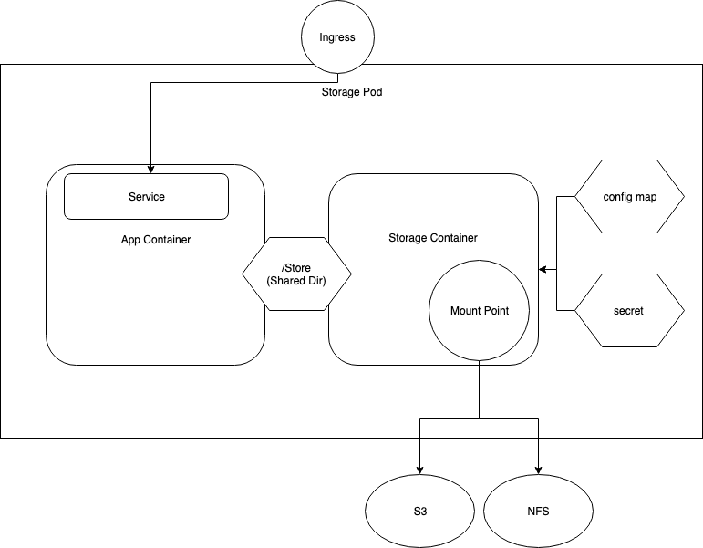

# External Datastore mount Sidecar

This project is about creating a container called datastore-attacher in Kubernetes cluster that provides the mounting functionality so that the container can mount to third-party storages such as NFS or S3

## Project Overview



There are three parts of project called ```mount_utility``` and ```s3fuse``` and ```samples``` directories.

* Under the ```mount_utility``` directory, the files contains the logic to parse the triliodata-secret and mount the datastores and another important file
to actually perform the mounting operation for the list of datastores

1. ```mount_datastores.py```: This file contains logic to mount the list of datastores found by the parser
2. ```triliodata_secret_parser.py```: This file contains the logic to parse the triliodata-secret mounted as a volume to the pod

* Under the ```s3fuse```, all the files to initialize the ```s3-fuse-plugin```

1. ```s3vaultfuse.py```: This file contains the logic to start the ```FUSE``` on the specified datastore path which will upload the data from that path to the datastore in blocks

## How to test in local environment

First, you need to have an NFS share and S3. Assume you have S3 and the credential information. Let's create an NFS share

* *create NFS local share*

    ```bash
    sudo mkdir /src/nfs/kubedata -p
    sudo chown nobody: /src/nfs/kubedata
    sudo apt-get update
    sudo apt install nfs-kernel-server
    sudo systemctl enable nfs-server
    ```

    Note: For each datastore to start, follow the same above steps

* *change the access*

    ```bash
    sudo vi /etc/exports
    /src/nfs/kubedata       *(rw,sync,no_subtree_check,no_root_squash,no_all_squash,insecure)
    sudo exportfs -rav
    sudo exportfs -v
    sudo service nfs-kernel-server restart
    ```

* *install microk8s*

    This could be replaced by other k8s local testor such as minikube
    Since I used ubuntu on aws ec2, microk8s was the right option

    ```bash
    sudo snap install microk8s --classic
    sudo -i
    echo "--allow-privileged=true" >> /var/snap/microk8s/current/args/kubelet
    echo "--allow-privileged=true" >> /var/snap/microk8s/current/args/kube-apiserver
    systemctl restart snap.microk8s.daemon-kubelet.service
    systemctl restart snap.microk8s.daemon-apiserver.service
    ```

* *DNS setting only for microk8s in ec2 environment*

    ```bash
    microk8s.enable dns
    sudo iptables -P FORWARD ACCEPT
    sudo apt-get install iptables-persistent
    sudo ufw default allow routed
    ```

* *Build the pod and run the containers*

    ```bash
    cd ./datastore-attacher-samples
    kubectl create secret generic trilio-secret --from-file=trilio-secret=trilio_secret.yaml
    kubectl create -f storage-pod-fs.yaml
    kubectl create -f fs_pvc_pv.yaml
    ```

## Useful Command

* restart nfs server
  ```sudo service nfs-kernel-server restart```
* Access to containers in the pod
  ```kubectl exec -it <pod name> /bin/sh```
* Similar situation as above, but when you have multi containers
  ```kubectl exec -it <pod name> --container <container name> /bin/sh```
