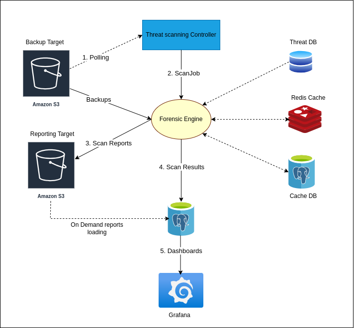
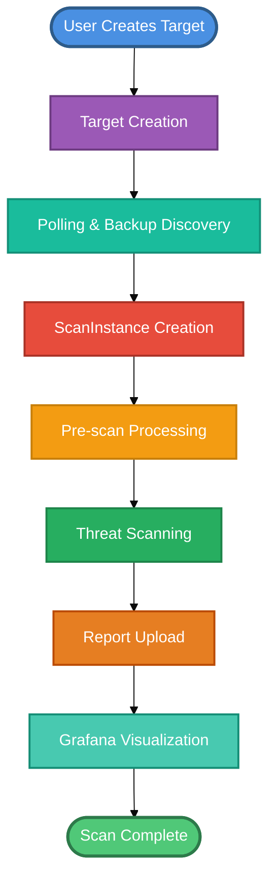
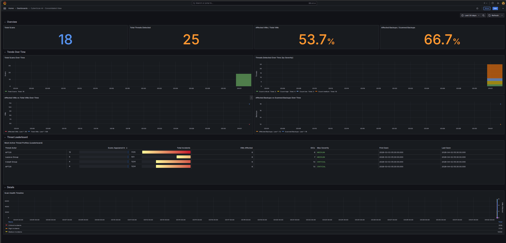
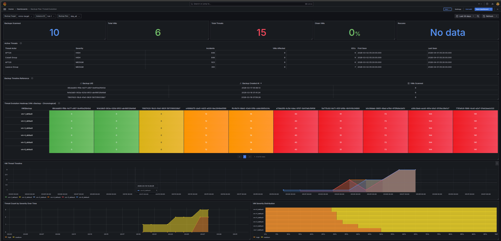

# Threat Scanning Architecture - Executive Demo Overview

## System Architecture

The architecture consists of:

- **Threat Scanning Controller**: Orchestrates the entire scanning workflow
- **Backup Target**: S3 storage containing VM backups to be scanned
- **Reporting Target**: S3 storage for scan reports and findings
- **Forensic Engine (Scan Job)**: Performs threat analysis on backups
- **Threat DB**: External threat intelligence database (CVE, Malware, IOCs)
- **Redis Cache & Cache DB (Postgres)**: Store scan results and metrics
- **Grafana Dashboard**: Visualizes security insights from the database

## End-to-End Workflow

## Component Overview

### 1. Threat Scanning Controller

Kubernetes controller that orchestrates the entire scanning lifecycle. Manages scan job creation, monitors progress, and handles error recovery.

### 2. Scan Job (Forensic Engine)

Unified scanning workload that discovers backups, extracts metadata, performs threat analysis using the Threat Database, and publishes results to Redis and Postgres.

### 3. Backup Target

S3 or NFS storage containing VM backup snapshots and disk images to be scanned. Provides read-only access for security analysis.

### 4. Reporting Target

S3-compatible storage for archiving threat scan reports and detailed security findings in JSON format.

### 5. Threat Database

External threat intelligence source providing up-to-date CVE database, malware signatures, known attack indicators, and security intelligence feeds.

### 6. Redis Database

High-performance in-memory cache for real-time scan metrics and intermediate scan results.

### 7. Postgres Database (Cache DB)

Relational database storing historical scan results, threat analytics, and time-series data. Primary data source for Grafana dashboards.

### 8. Grafana Dashboard

Interactive visualization platform that queries Postgres to display threat heatmaps, trends, statistics, and executive summary views.

#### Consolidated Dashboard

The consolidated dashboard provides an overview across all backups:
- **Overall Threat Statistics**: Aggregated metrics across all scanned backups
- **Backup Plan Evolution**: Trends showing threat patterns over time
- **Cross-Backup Analysis**: Comparative views of security posture
- **High-Level Insights**: Executive summary of the entire backup infrastructure

#### Detailed Backup Insights

The detailed dashboard provides deep insights into individual backups:
- **Unique Threats**: Count of distinct threats discovered in a specific backup
- **Threat IOCs**: Indicators of Compromise detected
- **Total Threats**: Overall threat count for the backup
- **IOC Risk Rate**: Percentage of critical security indicators
- **Threat Activity Heatmap**: Visual representation of threat density over time
- **Trend Analysis**: Historical threat patterns and evolution for the backup

## Key Benefits

✅ **Automated Security**: Continuous threat scanning of backup data without manual intervention

✅ **Kubernetes-Native**: Seamlessly integrates with Kubernetes workflows and GitOps practices

✅ **Scalable Architecture**: Handles large backup datasets with parallel job execution

✅ **Comprehensive Threat Detection**: Leverages multiple threat intelligence sources

✅ **Actionable Insights**: Clear visualizations help prioritize security responses

✅ **Storage Agnostic**: Works with various S3-compatible storage backends

---

*This document provides a high-level overview for executive demonstrations. Technical implementation details are available in separate documentation.*
